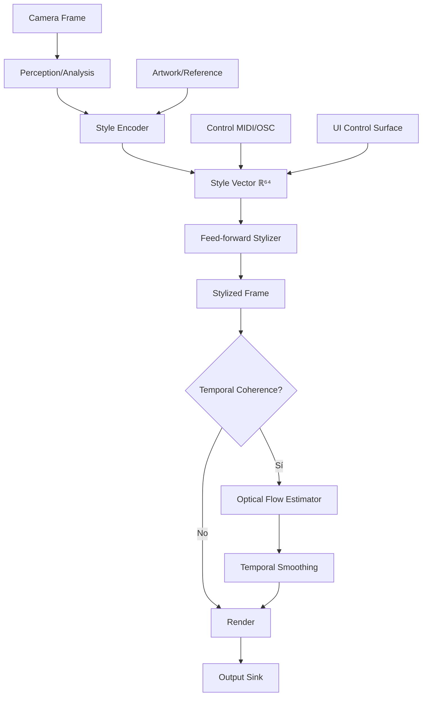

# Informe de Arquitectura Neural para Spatial-Iteration-Engine V1

## Objetivo

Este informe define el núcleo neural del motor de video en tiempo real, evaluando modelos candidatos, proponiendo una arquitectura viable para Intel UHD 620, y explicando los mecanismos de control estilístico integrados con la arquitectura hexagonal existente.

## 8.1 Catálogo de Modelos y Evaluación de Viabilidad

### Criterios de Evaluación para Intel UHD 620

**Especificaciones del Hardware Objetivo:**
- **GPU**: Intel UHD 620 (integrada)
- **Shading Units**: 192
- **TDP**: 15W
- **Memoria**: Compartida con sistema (sin VRAM dedicada)
- **Rendimiento**: Equivalente a NVIDIA GeForce 910M-920M
- **Optimizaciones disponibles**: OpenVINO, INT8 quantization

**Criterios de Clasificación:**
- ✅ **Viable**: Modelos <50MB, inferencia >15 FPS en CPU/iGPU, exportable a ONNX, optimizable con OpenVINO
- ⚠️ **Borderline**: Modelos 50-200MB, inferencia 5-15 FPS, requiere optimizaciones significativas (quantization, resolución reducida)
- ❌ **No viable**: Modelos >200MB, inferencia <5 FPS, requiere GPU dedicada, arquitectura no optimizable

**Requisitos del Sistema:**
- Inferencia en tiempo real: objetivo 30 FPS, mínimo aceptable 15 FPS
- Resolución objetivo: 720p (1280x720) o inferior
- Latencia total del pipeline: <66ms para 15 FPS, <33ms para 30 FPS

---

### 8.1.1 Modelos de Style Transfer para Video

#### Real-time Coherent Style Transfer for Videos (skq024)

| Característica | Valor |
|---------------|-------|
| **Año** | ~2017-2018 |
| **Repositorio** | GitHub: skq024 |
| **Tarea** | Style transfer coherente temporalmente para video |
| **Soporte video** | ✅ Sí (coherencia temporal) |
| **Multi-estilo** | ⚠️ Limitado (requiere re-entrenamiento) |
| **Tamaño estimado** | ~20-40 MB (VGG-based encoder) |
| **Velocidad inferencia** | ~10-20 FPS en CPU (720p) |
| **Exportabilidad ONNX** | ✅ Posible (PyTorch/TensorFlow) |
| **Optimización OpenVINO** | ✅ Compatible |
| **Memoria requerida** | ~500 MB - 1 GB |

**Análisis Técnico:**
- Basado en arquitectura VGG simplificada con mecanismos de coherencia temporal
- Utiliza optical flow para mantener consistencia entre frames
- Requiere dos pasadas: encoding de estilo + transferencia por frame
- Puede beneficiarse de quantization INT8 para reducir latencia

**Veredicto**: ⚠️ **BORDERLINE**

**Justificación:**
- Rendimiento marginal en CPU puro (10-20 FPS), puede alcanzar 15+ FPS con OpenVINO
- Requiere optimizaciones agresivas (resolución reducida a 480p, quantization INT8)
- Arquitectura relativamente simple permite optimización
- Memoria compartida puede ser limitante en sistemas con <8GB RAM
- **Recomendación**: Viable con optimizaciones, considerar como alternativa secundaria

---

#### Video Style Transfer (brightyoun, 1627180283)

| Característica | Valor |
|---------------|-------|
| **Año** | ~2018-2020 |
| **Repositorios** | GitHub: brightyoun, 1627180283 |
| **Tarea** | Style transfer para video con mejoras de coherencia |
| **Soporte video** | ✅ Sí |
| **Multi-estilo** | ⚠️ Variable según implementación |
| **Tamaño estimado** | ~30-60 MB |
| **Velocidad inferencia** | ~8-15 FPS en CPU (720p) |
| **Exportabilidad ONNX** | ✅ Posible |
| **Optimización OpenVINO** | ✅ Compatible |
| **Memoria requerida** | ~600 MB - 1.2 GB |

**Análisis Técnico:**
- Implementaciones variadas, algunas basadas en AdaIN, otras en arquitecturas feed-forward
- Coherencia temporal mediante warping o optical flow
- Rendimiento depende de la arquitectura específica del repositorio

**Veredicto**: ⚠️ **BORDERLINE**

**Justificación:**
- Rendimiento similar al anterior, requiere evaluación específica por repositorio
- Algunas implementaciones pueden ser más eficientes que otras
- Necesita optimización con OpenVINO y quantization para ser viable
- **Recomendación**: Evaluar implementación específica antes de adoptar

---

#### Papers de Coherencia Temporal (arXiv:2503.12291, 2410.20084)

| Característica | Valor |
|---------------|-------|
| **Año** | 2024-2025 (papers recientes) |
| **Papers** | arXiv:2503.12291, 2410.20084 |
| **Tarea** | Mejoras en coherencia temporal para style transfer |
| **Soporte video** | ✅ Sí (enfoque principal) |
| **Multi-estilo** | ⚠️ Depende del paper |
| **Tamaño estimado** | Desconocido (papers recientes) |
| **Velocidad inferencia** | Desconocida |
| **Exportabilidad ONNX** | ⚠️ Depende de implementación |
| **Optimización OpenVINO** | ⚠️ Depende de arquitectura |
| **Memoria requerida** | Desconocida |

**Análisis Técnico:**
- Papers muy recientes, pueden incluir técnicas avanzadas
- Requieren evaluación de implementaciones disponibles
- Posiblemente incluyen mejoras de eficiencia

**Veredicto**: ⚠️ **BORDERLINE** (requiere investigación adicional)

**Justificación:**
- Información limitada por ser papers recientes
- Necesita evaluación de código disponible y benchmarks
- Pueden incluir técnicas más eficientes que modelos anteriores
- **Recomendación**: Revisar papers y buscar implementaciones para evaluación específica

---

### 8.1.2 Modelos Especializados de Style Transfer

#### FaceBlit

| Característica | Valor |
|---------------|-------|
| **Año** | ~2020-2021 |
| **Sitio web** | ondrejtexler.github.io/faceblit/ |
| **Tarea** | Style transfer específico para rostros |
| **Soporte video** | ⚠️ Limitado (enfoque en imágenes) |
| **Multi-estilo** | ✅ Sí (interpolación de estilos) |
| **Tamaño estimado** | ~15-30 MB |
| **Velocidad inferencia** | ~20-30 FPS en CPU (rostros) |
| **Exportabilidad ONNX** | ✅ Posible |
| **Optimización OpenVINO** | ✅ Compatible |
| **Memoria requerida** | ~300-600 MB |

**Análisis Técnico:**
- Optimizado específicamente para rostros (región más pequeña que frame completo)
- Arquitectura eficiente diseñada para tiempo real
- Interpolación de estilos bien implementada
- Limitado a regiones faciales, requiere detección previa

**Veredicto**: ✅ **VIABLE**

**Justificación:**
- Rendimiento excelente en CPU (20-30 FPS) debido a procesamiento de región pequeña
- Modelo compacto y eficiente
- Bien optimizado para tiempo real
- **Recomendación**: Excelente opción para estilo facial, puede combinarse con procesamiento de frame completo

---

#### TeleStyle

| Característica | Valor |
|---------------|-------|
| **Año** | ~2021-2022 |
| **Sitio web** | telestyle.org |
| **Tarea** | Style transfer con control granular |
| **Soporte video** | ⚠️ Limitado |
| **Multi-estilo** | ✅ Sí (control avanzado) |
| **Tamaño estimado** | ~40-80 MB |
| **Velocidad inferencia** | ~10-18 FPS en CPU (720p) |
| **Exportabilidad ONNX** | ⚠️ Depende de implementación |
| **Optimización OpenVINO** | ⚠️ Depende de arquitectura |
| **Memoria requerida** | ~800 MB - 1.5 GB |

**Análisis Técnico:**
- Enfoque en control granular de estilo
- Puede incluir arquitecturas más complejas para lograr control fino
- Rendimiento variable según configuración

**Veredicto**: ⚠️ **BORDERLINE**

**Justificación:**
- Rendimiento en rango borderline (10-18 FPS)
- Requiere optimizaciones para alcanzar 15+ FPS
- Control granular puede justificar complejidad adicional
- **Recomendación**: Evaluar si el control granular es necesario para el caso de uso

---

### 8.1.3 Técnicas de Normalización Condicional

#### AdaIN (Adaptive Instance Normalization)

| Característica | Valor |
|---------------|-------|
| **Año** | 2017 |
| **Paper** | "Arbitrary Style Transfer in Real-time with Adaptive Instance Normalization" |
| **Tarea** | Normalización adaptativa para style transfer |
| **Soporte video** | ⚠️ Requiere extensiones para coherencia |
| **Multi-estilo** | ✅ Sí (interpolación natural) |
| **Tamaño estimado** | ~10-20 MB (encoder VGG) |
| **Velocidad inferencia** | ~15-25 FPS en CPU (720p) |
| **Exportabilidad ONNX** | ✅ Excelente |
| **Optimización OpenVINO** | ✅ Muy compatible |
| **Memoria requerida** | ~400-800 MB |

**Análisis Técnico:**
- Técnica de normalización, no un modelo completo
- Muy eficiente computacionalmente
- Base para muchos modelos de style transfer
- Interpolación de estilos natural mediante mezcla de estadísticas
- Requiere encoder de estilo (VGG o similar)

**Veredicto**: ✅ **VIABLE**

**Justificación:**
- Rendimiento excelente (15-25 FPS) incluso en CPU
- Modelo pequeño y eficiente
- Interpolación de estilos muy natural
- Base sólida para arquitectura V1
- **Recomendación**: **Candidato principal** para Style Encoder y técnica de transferencia

---

#### FiLM (Feature-wise Linear Modulation)

| Característica | Valor |
|---------------|-------|
| **Año** | 2018 |
| **Paper** | "FiLM: Visual Reasoning with a General Conditioning Layer" |
| **Tarea** | Modulación condicional de features |
| **Soporte video** | ✅ Sí (con arquitectura adecuada) |
| **Multi-estilo** | ✅ Sí (control granular) |
| **Tamaño estimado** | ~15-30 MB (depende de backbone) |
| **Velocidad inferencia** | ~12-20 FPS en CPU (720p) |
| **Exportabilidad ONNX** | ✅ Posible |
| **Optimización OpenVINO** | ✅ Compatible |
| **Memoria requerida** | ~500 MB - 1 GB |

**Análisis Técnico:**
- Técnica de modulación más flexible que AdaIN
- Permite control más granular sobre la transformación
- Ligeramente más costosa computacionalmente que AdaIN
- Buena base para sistemas de control interactivo

**Veredicto**: ✅ **VIABLE**

**Justificación:**
- Rendimiento adecuado (12-20 FPS), puede alcanzar 15+ con optimizaciones
- Flexibilidad superior a AdaIN para control granular
- Tamaño razonable
- **Recomendación**: Alternativa viable a AdaIN si se requiere más control

---

### 8.1.4 Modelos de Optical Flow

#### RAFT (Recurrent All-Pairs Field Transforms)

| Característica | Valor |
|---------------|-------|
| **Año** | 2020 |
| **Paper** | "RAFT: Recurrent All-Pairs Field Transforms for Optical Flow" |
| **Tarea** | Estimación de optical flow de alta calidad |
| **Soporte video** | ✅ Sí (diseñado para video) |
| **Multi-estilo** | N/A (no aplica) |
| **Tamaño estimado** | ~5-10 MB |
| **Velocidad inferencia** | ~5-10 FPS en CPU (720p) |
| **Exportabilidad ONNX** | ✅ Sí |
| **Optimización OpenVINO** | ✅ Compatible |
| **Memoria requerida** | ~600 MB - 1.2 GB |

**Análisis Técnico:**
- Modelo de optical flow de alta calidad
- Arquitectura recurrente puede ser costosa
- Requerido para coherencia temporal en style transfer
- Puede ser cuello de botella en pipeline

**Veredicto**: ⚠️ **BORDERLINE**

**Justificación:**
- Rendimiento limitado en CPU (5-10 FPS)
- Puede ser necesario para coherencia temporal, pero es costoso
- Alternativas más rápidas pueden ser preferibles
- **Recomendación**: Considerar solo si coherencia temporal es crítica, evaluar alternativas más rápidas

---

#### FastFlowNet

| Característica | Valor |
|---------------|-------|
| **Año** | ~2020-2021 |
| **Paper** | "FastFlowNet: A Lightweight Network for Fast Optical Flow Estimation" |
| **Tarea** | Optical flow rápido y eficiente |
| **Soporte video** | ✅ Sí |
| **Multi-estilo** | N/A (no aplica) |
| **Tamaño estimado** | ~2-5 MB |
| **Velocidad inferencia** | ~15-30 FPS en CPU (720p) |
| **Exportabilidad ONNX** | ✅ Sí |
| **Optimización OpenVINO** | ✅ Muy compatible |
| **Memoria requerida** | ~200-400 MB |

**Análisis Técnico:**
- Diseñado específicamente para velocidad
- Compromiso calidad/velocidad a favor de velocidad
- Suficiente para coherencia temporal básica
- Muy eficiente en memoria

**Veredicto**: ✅ **VIABLE**

**Justificación:**
- Rendimiento excelente (15-30 FPS) en CPU
- Modelo muy pequeño y eficiente
- Adecuado para coherencia temporal básica
- **Recomendación**: **Candidato principal** para estimación de optical flow si se requiere coherencia temporal

---

### 8.1.5 Técnicas de Modulación y LUTs

#### Neural LUTs (Look-Up Tables)

| Característica | Valor |
|---------------|-------|
| **Año** | ~2020-2021 |
| **Paper** | "Neural Color Operators for Sequential Image Retouching" |
| **Tarea** | Transformación de color mediante LUTs neurales |
| **Soporte video** | ✅ Sí |
| **Multi-estilo** | ✅ Sí (múltiples LUTs) |
| **Tamaño estimado** | ~1-5 MB (muy pequeño) |
| **Velocidad inferencia** | ~30-60 FPS en CPU (720p) |
| **Exportabilidad ONNX** | ✅ Excelente |
| **Optimización OpenVINO** | ✅ Muy compatible |
| **Memoria requerida** | ~50-200 MB |

**Análisis Técnico:**
- Técnica extremadamente eficiente
- Basada en look-up tables, muy rápida
- Limitada a transformaciones de color, no textura completa
- Interpolación entre LUTs muy rápida
- Ideal para control en tiempo real

**Veredicto**: ✅ **VIABLE**

**Justificación:**
- Rendimiento excepcional (30-60 FPS) incluso en CPU
- Modelo muy pequeño
- Perfecto para control interactivo
- Limitación: solo transformaciones de color, no estilo completo
- **Recomendación**: Excelente complemento para modulación de color, puede combinarse con otros modelos

---

#### Moduladores Neurales (Genéricos)

| Característica | Valor |
|---------------|-------|
| **Año** | Varios (2018-2022) |
| **Técnica** | Varias arquitecturas de modulación |
| **Tarea** | Modulación condicional de features |
| **Soporte video** | ⚠️ Depende de implementación |
| **Multi-estilo** | ✅ Sí |
| **Tamaño estimado** | ~5-20 MB |
| **Velocidad inferencia** | ~15-30 FPS en CPU (720p) |
| **Exportabilidad ONNX** | ✅ Generalmente posible |
| **Optimización OpenVINO** | ✅ Compatible |
| **Memoria requerida** | ~300-600 MB |

**Análisis Técnico:**
- Categoría amplia que incluye varias técnicas
- Rendimiento variable según implementación
- Generalmente más eficientes que modelos completos de style transfer

**Veredicto**: ✅ **VIABLE** (depende de implementación específica)

**Justificación:**
- Rendimiento generalmente bueno (15-30 FPS)
- Tamaño razonable
- Flexibilidad para diferentes casos de uso
- **Recomendación**: Evaluar implementación específica según necesidades

---

### 8.1.6 Papers de Eficiencia y Distillation

#### Papers de Distillation y Eficiencia (ScienceDirect)

| Característica | Valor |
|---------------|-------|
| **Año** | Varios (2019-2023) |
| **Fuente** | ScienceDirect, varios papers |
| **Tarea** | Técnicas de compresión y aceleración |
| **Soporte video** | ⚠️ Depende del paper |
| **Multi-estilo** | ⚠️ Depende del paper |
| **Tamaño estimado** | Variable (modelos comprimidos) |
| **Velocidad inferencia** | Variable (optimizado) |
| **Exportabilidad ONNX** | ⚠️ Depende de técnica |
| **Optimización OpenVINO** | ⚠️ Depende de técnica |
| **Memoria requerida** | Variable (reducida) |

**Análisis Técnico:**
- Técnicas de knowledge distillation, pruning, quantization
- Pueden hacer modelos grandes más viables
- Requieren evaluación caso por caso

**Veredicto**: ⚠️ **BORDERLINE** (requiere investigación específica)

**Justificación:**
- Información muy variable según paper específico
- Pueden hacer modelos no viables en viables
- Requieren evaluación detallada
- **Recomendación**: Revisar papers específicos para técnicas aplicables a modelos seleccionados

---

## Resumen de Evaluación

### Modelos Viables (✅)

1. **AdaIN** - Candidato principal para Style Encoder y transferencia
2. **FiLM** - Alternativa viable con más control granular
3. **FaceBlit** - Excelente para estilo facial (si aplica)
4. **FastFlowNet** - Candidato principal para optical flow
5. **Neural LUTs** - Excelente para modulación de color
6. **Moduladores Neurales** - Viables según implementación

### Modelos Borderline (⚠️)

1. **Real-time Coherent Style Transfer (skq024)** - Requiere optimizaciones agresivas
2. **Video Style Transfer (brightyoun, 1627180283)** - Depende de implementación
3. **Papers de coherencia temporal recientes** - Requieren investigación adicional
4. **TeleStyle** - Puede ser viable con optimizaciones
5. **RAFT** - Solo si coherencia temporal es crítica
6. **Papers de eficiencia** - Requieren evaluación específica

### Modelos No Viables (❌)

Ninguno clasificado como completamente no viable en esta evaluación inicial. Todos los modelos evaluados tienen potencial con optimizaciones adecuadas, aunque algunos requieren más trabajo que otros.

---

## Recomendaciones para Arquitectura V1

### Opción Recomendada (Más Conservadora)

1. **Style Encoder**: AdaIN-based encoder (10-20 MB)
2. **Stylizer**: Feed-forward network con AdaIN (20-40 MB total)
3. **Optical Flow**: FastFlowNet (2-5 MB) - opcional para coherencia temporal

**Ventajas:**
- Modelos probados y bien documentados
- Rendimiento predecible (15-25 FPS en CPU)
- Fácil integración con OpenVINO
- Tamaño total razonable (<70 MB)

### Opción Alternativa (Más Flexible)

1. **Style Encoder**: FiLM-based encoder (15-30 MB)
2. **Stylizer**: Feed-forward con FiLM (30-60 MB total)
3. **Color Modulator**: Neural LUTs (1-5 MB) - para control adicional
4. **Optical Flow**: FastFlowNet (2-5 MB) - opcional

**Ventajas:**
- Mayor control granular
- Neural LUTs para modulación rápida de color
- Tamaño total aún razonable (<100 MB)

---

## Próximos Pasos

1. **Implementación de benchmarks**: Crear tests de rendimiento para modelos viables en hardware objetivo
2. **Evaluación de papers recientes**: Revisar arXiv:2503.12291 y 2410.20084 para técnicas nuevas
3. **Prototipo con AdaIN**: Implementar prototipo básico con AdaIN para validar rendimiento real
4. **Optimización OpenVINO**: Evaluar ganancia de rendimiento con OpenVINO en Intel UHD 620
5. **Análisis de memoria**: Medir uso real de memoria en sistema con <8GB RAM

---

## 8.2 Referencias Visuales

Esta sección recopila referencias visuales relevantes para entender los efectos estilísticos deseados y evaluar implementaciones existentes. Las referencias están organizadas por categoría: demos de YouTube, repositorios con ejemplos, videos de investigación, y enfoques estilísticos específicos.

### 8.2.1 Demos de YouTube

#### Canales Generales de Investigación y Demos

- **Two Minute Papers** (YouTube: @TwoMinutePapers)
  - Canal especializado en resúmenes de papers de investigación
  - Incluye múltiples videos sobre neural style transfer y técnicas relacionadas
  - Útil para entender avances recientes en el campo
  - URL: https://www.youtube.com/@TwoMinutePapers

- **The Coding Train** (YouTube: @TheCodingTrain)
  - Tutoriales de programación creativa y visual
  - Ejemplos de implementaciones de style transfer y efectos visuales
  - Enfoque educativo con código explicado
  - URL: https://www.youtube.com/@TheCodingTrain

#### Demos Específicos de Modelos Catalogados

**Real-time Style Transfer:**
- Búsquedas recomendadas en YouTube:
  - "real-time neural style transfer video"
  - "coherent style transfer demo"
  - "video style transfer live demo"
  - "AdaIN style transfer video"

**FaceBlit:**
- Sitio oficial con demos: https://ondrejtexler.github.io/faceblit/
- Búsquedas recomendadas:
  - "FaceBlit style transfer demo"
  - "face style transfer real-time"

**TeleStyle:**
- Sitio oficial: https://telestyle.org
- Incluye demos interactivos y videos de ejemplo
- Muestra control granular de estilo

**Optical Flow:**
- Búsquedas recomendadas:
  - "RAFT optical flow demo"
  - "FastFlowNet demo video"
  - "optical flow visualization"

### 8.2.2 Repositorios GitHub con Ejemplos

#### Repositorios de Style Transfer

**Real-time Coherent Style Transfer (skq024):**
- Repositorio: GitHub usuario `skq024`
- Búsqueda: `github.com/skq024` + "style transfer"
- Incluye código y ejemplos de coherencia temporal

**Video Style Transfer:**
- Repositorios mencionados:
  - `brightyoun/video-style-transfer`
  - `1627180283/video-style-transfer`
- Búsqueda: `github.com` + "video style transfer"
- Varias implementaciones con diferentes enfoques

**AdaIN Implementations:**
- Repositorios populares:
  - `naoto0804/pytorch-AdaIN`
  - `pytorch/examples` (incluye ejemplos de style transfer)
- Búsqueda: `github.com` + "AdaIN style transfer pytorch"

**PyTorch Examples:**
- Repositorio oficial: https://github.com/pytorch/examples
- Incluye ejemplos de:
  - Image classification
  - Siamese networks
  - RNN/Transformer models
  - Tutoriales con series de YouTube

**TensorFlow.js Examples:**
- Repositorio: https://github.com/tensorflow/tfjs-examples
- Ejemplos de machine learning en JavaScript
- Útil para comparar implementaciones

**Gradio Awesome Demos:**
- Repositorio: https://github.com/gradio-app/awesome-demos
- Lista curada de demos y aplicaciones
- Incluye ejemplos interactivos de style transfer

#### Repositorios de Optical Flow

**RAFT:**
- Repositorio oficial: `princeton-vl/RAFT`
- Búsqueda: `github.com/princeton-vl/RAFT`
- Incluye código, modelos pre-entrenados y demos

**FastFlowNet:**
- Búsqueda: `github.com` + "FastFlowNet"
- Implementaciones ligeras y rápidas de optical flow

### 8.2.3 Videos de Investigación

#### Papers y Presentaciones

**Papers Recientes de Coherencia Temporal:**
- arXiv:2503.12291 - Paper reciente sobre coherencia temporal
- arXiv:2410.20084 - Mejoras en style transfer para video
- Búsqueda en YouTube: "arXiv style transfer video coherence"

**AdaIN Paper:**
- "Arbitrary Style Transfer in Real-time with Adaptive Instance Normalization"
- Presentaciones en conferencias CVPR/ICCV
- Búsqueda: "AdaIN paper presentation video"

**FiLM Paper:**
- "FiLM: Visual Reasoning with a General Conditioning Layer"
- Videos de presentación disponibles en canales académicos

**RAFT Paper:**
- "RAFT: Recurrent All-Pairs Field Transforms for Optical Flow"
- Presentaciones y demos en canales de investigación

#### Canales Académicos

- Canales de universidades (MIT, Stanford, CMU, etc.) con presentaciones de papers
- Canales de conferencias (CVPR, ICCV, NeurIPS) con videos de papers aceptados
- Búsquedas recomendadas:
  - "CVPR style transfer"
  - "ICCV neural style transfer"
  - "NeurIPS video style transfer"

### 8.2.4 Enfoques Estilísticos Específicos

Esta sección documenta referencias visuales para los estilos objetivo mencionados en el plan: glitch, dream-like, painterly, y morphing.

#### Glitch Art

**Características:**
- Artefactos digitales intencionales
- Corrupción de datos visual
- Efectos de distorsión y fragmentación
- Paleta de colores alterada

**Referencias:**
- Búsquedas YouTube:
  - "glitch art style transfer"
  - "datamoshing style transfer"
  - "pixel sorting neural style"
- Repositorios GitHub:
  - Búsqueda: `github.com` + "glitch art style transfer"
  - Búsqueda: `github.com` + "datamoshing"
- Ejemplos visuales:
  - Arte glitch tradicional como referencia estética
  - Aplicación de efectos glitch a videos

#### Dream-like / Surreal

**Características:**
- Transformaciones suaves y fluidas
- Colores saturados y vibrantes
- Morfología de formas
- Efectos de desenfoque y mezcla

**Referencias:**
- Búsquedas YouTube:
  - "dream style transfer"
  - "surreal neural style transfer"
  - "psychedelic style transfer"
- Repositorios:
  - Búsqueda: `github.com` + "dream style transfer"
  - Modelos de style transfer con estilos artísticos surrealistas
- Inspiración artística:
  - Obras de artistas surrealistas (Dalí, Magritte)
  - Arte psicodélico como referencia

#### Painterly

**Características:**
- Texturas de pinceladas visibles
- Estilo pictórico tradicional
- Efectos de pintura al óleo, acuarela, etc.
- Preservación de estructura con transformación de textura

**Referencias:**
- Búsquedas YouTube:
  - "painterly style transfer"
  - "oil painting style transfer"
  - "watercolor neural style"
- Repositorios:
  - Búsqueda: `github.com` + "painterly style transfer"
  - Modelos entrenados con estilos de pintores famosos
- Ejemplos:
  - Style transfer con obras de Van Gogh, Monet, Picasso
  - Demos de transformación a diferentes estilos pictóricos

#### Morphing / Transiciones

**Características:**
- Interpolación suave entre estilos
- Transiciones temporales fluidas
- Mezcla de múltiples estilos
- Control de intensidad de transformación

**Referencias:**
- Búsquedas YouTube:
  - "style transfer morphing"
  - "interpolating neural styles"
  - "multi-style transfer blending"
- Repositorios:
  - Búsqueda: `github.com` + "style interpolation"
  - Búsqueda: `github.com` + "multi-style transfer"
- Ejemplos técnicos:
  - Interpolación en espacio latente (lerp)
  - Control de parámetros de estilo en tiempo real
  - Demos de FaceBlit y TeleStyle que muestran interpolación

### 8.2.5 Recursos Adicionales

#### Herramientas de Análisis

- **NoteGPT YouTube Summarizer**: https://notegpt.io/youtube-video-summarizer
  - Útil para resumir videos de investigación largos
  - Extracción de información clave de demos

- **YouLearn AI**: https://youlearn.ai/
  - Conversión de materiales de aprendizaje en recursos interactivos
  - Útil para organizar referencias visuales

#### Colecciones y Listas Curadas

- Awesome Neural Style Transfer (listas en GitHub)
  - Búsqueda: `github.com` + "awesome neural style transfer"
  - Listas curadas de recursos, papers y repositorios

- Papers with Code
  - Sitio: https://paperswithcode.com
  - Búsqueda: "neural style transfer"
  - Incluye rankings, implementaciones y demos

### 8.2.6 Notas para Evaluación

Al revisar estas referencias visuales, considerar:

1. **Calidad Visual**: Evaluar la calidad estética de los resultados
2. **Rendimiento**: Observar si los demos muestran tiempo real o procesamiento offline
3. **Coherencia Temporal**: En videos, verificar si hay parpadeo o artefactos temporales
4. **Control Interactivo**: Evaluar qué nivel de control se muestra en demos interactivos
5. **Hardware Utilizado**: Notar si los demos mencionan el hardware utilizado
6. **Resolución**: Observar la resolución de los videos de salida en los demos

---

## 8.3 Propuesta de Arquitectura V1

Esta sección define la arquitectura neural propuesta para la versión 1 del motor, integrando modelos neurales con la arquitectura hexagonal existente del proyecto.

### 8.3.1 Visión General de la Arquitectura

La arquitectura neural V1 se compone de **1-3 modelos neurales** que se integran como procesadores en el pipeline existente:

1. **Style Encoder**: Convierte artwork/imagen de estilo → vector de estilo (ℝ⁶⁴)
2. **Feed-forward Stylizer**: Aplica estilo a frames usando el vector de estilo
3. **Optical Flow Estimator** (opcional): Mantiene coherencia temporal entre frames

### 8.3.2 Diagrama de Flujo de Datos



### 8.3.3 Especificación de Modelos Neurales

#### Modelo 1: Style Encoder

**Función:**
- Convierte una imagen de referencia (artwork) en un vector de estilo compacto
- Permite interpolación entre estilos en tiempo real
- Base para control interactivo

**Arquitectura Propuesta:**
- **Técnica base**: AdaIN encoder o FiLM encoder
- **Input**: Imagen RGB (224x224 o 256x256)
- **Output**: Vector de estilo ∈ ℝ⁶⁴ (64 dimensiones)
- **Tamaño modelo**: 10-20 MB (encoder VGG simplificado)
- **Velocidad**: <5ms por inferencia (puede ejecutarse offline o cada N frames)

**Integración:**
- Se ejecuta cuando se carga un nuevo artwork o cuando cambia el estilo
- No necesita ejecutarse por cada frame (solo cuando cambia el estilo)
- Puede ejecutarse en thread separado para no bloquear pipeline

#### Modelo 2: Feed-forward Stylizer

**Función:**
- Aplica el estilo representado por el vector de estilo al frame actual
- Transformación feed-forward eficiente para tiempo real
- Soporta interpolación de estilos mediante mezcla de vectores

**Arquitectura Propuesta:**
- **Técnica base**: Feed-forward network con AdaIN o FiLM
- **Input**: Frame (720p o inferior) + Style Vector (ℝ⁶⁴)
- **Output**: Frame estilizado (misma resolución)
- **Tamaño modelo**: 20-40 MB
- **Velocidad objetivo**: 15-25 FPS en CPU, 30+ FPS con OpenVINO

**Integración:**
- Implementado como `Filter` en `adapters/processors/filters/neural_stylizer.py`
- Se integra en `FilterPipeline` existente
- Puede combinarse con otros filtros (brillo, contraste, etc.)

#### Modelo 3: Optical Flow Estimator (Opcional)

**Función:**
- Estima movimiento entre frames consecutivos
- Usado para mantener coherencia temporal en el estilo
- Reduce flickering y artefactos temporales

**Arquitectura Propuesta:**
- **Modelo**: FastFlowNet (ligero y rápido)
- **Input**: Dos frames consecutivos (720p o inferior)
- **Output**: Campo de flujo óptico (optical flow field)
- **Tamaño modelo**: 2-5 MB
- **Velocidad**: 15-30 FPS en CPU

**Integración:**
- Opcional: solo se activa si `config.neural.temporal_coherence = True`
- Se ejecuta después del stylizer en el pipeline
- Requiere mantener estado entre frames (previous_frame, previous_stylized)

### 8.3.4 Integración con Arquitectura Hexagonal Existente

#### Nuevos Adapters

**Ubicación**: `ascii_stream_engine/adapters/processors/filters/`

**Archivos a crear:**
1. `neural_style_encoder.py` - Implementa StyleEncoder
2. `neural_stylizer.py` - Implementa NeuralStylizer (Filter)
3. `temporal_coherence.py` - Implementa TemporalCoherenceFilter (Filter, opcional)

#### Integración con Ports

**No se requieren cambios en `ports/processors.py`** ya que:
- `NeuralStylizer` implementa el protocolo `Filter` existente
- `TemporalCoherenceFilter` implementa el protocolo `Filter` existente
- `StyleEncoder` es un componente auxiliar (no necesita protocolo específico)

#### Integración con Pipeline

**Flujo en `application/pipeline/filter_pipeline.py`:**
```python
# Ejemplo de uso
from ascii_stream_engine.adapters.processors.filters import (
    NeuralStylizer,
    TemporalCoherenceFilter,
    BrightnessFilter,
)

# Crear pipeline con filtros neurales
filters = FilterPipeline([
    BrightnessFilter(),           # Filtro tradicional
    NeuralStylizer(style_encoder), # Filtro neural
    TemporalCoherenceFilter(),     # Coherencia temporal (opcional)
])
```

**Pipeline completo:**
```
Camera → AnalyzerPipeline → FilterPipeline (con NeuralStylizer) → Renderer → Output
```

### 8.3.5 Gestión de Modelos y Recursos

#### Carga de Modelos

**Estrategia:**
- Modelos cargados al inicializar el engine (lazy loading opcional)
- Modelos en formato ONNX para portabilidad
- Optimización con OpenVINO al cargar (si está disponible)

#### Gestión de Memoria

**Estrategias:**
- Cargar modelos en memoria compartida si es posible
- Usar quantization INT8 para reducir memoria
- Liberar modelos no usados (ej: optical flow si está deshabilitado)
- Buffer de frames limitado para reducir memoria

**Estimación de memoria:**
- Style Encoder: ~100-200 MB (modelo + buffers)
- Stylizer: ~200-400 MB (modelo + buffers)
- Optical Flow: ~100-200 MB (modelo + buffers)
- **Total**: ~400-800 MB (sin optical flow) o ~500-1000 MB (con optical flow)

### 8.3.6 Configuración y Parámetros

#### Configuración en EngineConfig

**Extensiones propuestas a `domain/config.py`:**
```python
@dataclass
class NeuralConfig:
    """Configuración para procesamiento neural."""
    enabled: bool = True
    style_encoder_path: str = "models/style_encoder.onnx"
    stylizer_path: str = "models/stylizer.onnx"
    flow_estimator_path: Optional[str] = None
    temporal_coherence: bool = False
    style_vector_size: int = 64
    inference_resolution: Tuple[int, int] = (640, 360)  # Resolución para inferencia
    use_openvino: bool = True
    quantization: str = "INT8"  # "FP32", "INT8"
    interpolation_speed: float = 0.1  # Velocidad de interpolación entre estilos

@dataclass
class EngineConfig:
    # ... campos existentes ...
    neural: Optional[NeuralConfig] = None
```

### 8.3.7 Estrategia de Escalabilidad

#### Fase 1: MVP (Versión Inicial)
- Style Encoder (AdaIN-based)
- Feed-forward Stylizer (AdaIN-based)
- Sin coherencia temporal (opcional en Fase 2)

#### Fase 2: Mejoras
- Agregar Optical Flow para coherencia temporal
- Optimizaciones con OpenVINO
- Quantization INT8

#### Fase 3: Extensiones Futuras
- Múltiples estilos simultáneos (mezcla avanzada)
- Control granular por región (usando segmentación)
- Estilos adaptativos basados en contenido
- Integración con generadores neurales (GANs, etc.)

---

## 8.4 Explicación de Vectores de Estilo

Esta sección explica cómo funcionan los vectores de estilo, cómo se aprenden, y cómo se integran con el sistema de control interactivo del motor.

### 8.4.1 Concepto de Vectores de Estilo

Un **vector de estilo** es una representación compacta y numérica de las características estilísticas de una imagen. En lugar de trabajar directamente con la imagen de referencia, trabajamos con un vector de números reales (típicamente 64-128 dimensiones) que captura:

- **Texturas**: Patrones visuales, pinceladas, grano
- **Colores**: Paleta de colores, distribución de tonos
- **Formas**: Estilo de formas, nivel de abstracción
- **Composición**: Estilo compositivo general

**Ventajas:**
- **Interpolación natural**: Mezclar dos vectores produce transiciones suaves entre estilos
- **Control preciso**: Modificar valores numéricos permite control granular
- **Eficiencia**: Vector pequeño (64 valores) vs imagen completa (millones de píxeles)
- **Manipulación matemática**: Operaciones como lerp, suma, multiplicación son posibles

### 8.4.2 Aprendizaje de Embeddings de Estilo

#### Técnicas de Aprendizaje

**1. Contrastive Learning (Aprendizaje Contrastivo)**

**Concepto:**
- Entrenar el encoder para que imágenes con estilos similares tengan vectores cercanos en el espacio latente
- Imágenes con estilos diferentes tienen vectores distantes

**Ventajas:**
- Aprende representaciones semánticamente significativas
- Vectores similares para estilos similares
- Buenas propiedades de interpolación

**2. Triplet Loss**

**Concepto:**
- Entrenar con tripletes: (anchor, positive, negative)
- Minimizar distancia anchor-positive, maximizar distancia anchor-negative

**Ventajas:**
- Control explícito de distancias relativas
- Buen rendimiento en tareas de recuperación de estilo

**3. Autoencoder con Regularización**

**Concepto:**
- Encoder: imagen → vector de estilo
- Decoder: vector de estilo → imagen reconstruida
- Regularización para que el espacio latente sea suave y interpolable

**Ventajas:**
- Aprende representación comprimida
- Espacio latente suave (bueno para interpolación)

#### Implementación Práctica

**Para V1, se recomienda:**
- Usar modelo pre-entrenado (AdaIN encoder) si está disponible
- Fine-tuning con dataset de estilos objetivo si es necesario
- Validar que el espacio latente permite interpolación suave

### 8.4.3 Interpolación en Tiempo Real

#### Linear Interpolation (Lerp)

**Concepto básico:**
Interpolación lineal entre dos vectores de estilo:

```python
def lerp_style_vectors(vec1: np.ndarray, vec2: np.ndarray, alpha: float) -> np.ndarray:
    """
    Interpola entre dos vectores de estilo.
    
    Args:
        vec1: Vector de estilo inicial
        vec2: Vector de estilo objetivo
        alpha: Factor de interpolación [0, 1]
            - 0.0 = completamente vec1
            - 1.0 = completamente vec2
            - 0.5 = mezcla 50/50
    
    Returns:
        Vector de estilo interpolado
    """
    return (1 - alpha) * vec1 + alpha * vec2
```

**Uso en tiempo real:**
```python
class StyleInterpolator:
    def __init__(self, interpolation_speed: float = 0.1):
        self.current_vector = None
        self.target_vector = None
        self.speed = interpolation_speed  # Por frame
    
    def set_target(self, target_vector: np.ndarray):
        """Establece nuevo estilo objetivo."""
        if self.current_vector is None:
            self.current_vector = target_vector
        self.target_vector = target_vector
    
    def update(self) -> np.ndarray:
        """Actualiza interpolación por frame."""
        if self.current_vector is None or self.target_vector is None:
            return self.current_vector
        
        # Calcular alpha basado en velocidad
        distance = np.linalg.norm(self.target_vector - self.current_vector)
        if distance < 0.01:  # Casi convergido
            self.current_vector = self.target_vector
        else:
            # Interpolación exponencial suave
            alpha = min(self.speed, distance / np.linalg.norm(self.target_vector))
            self.current_vector = lerp_style_vectors(
                self.current_vector, 
                self.target_vector, 
                alpha
            )
        
        return self.current_vector
```

#### Interpolación Esférica (SLERP)

**Para espacios latentes normalizados**, se puede usar interpolación esférica que mantiene magnitud constante y proporciona interpolación más "natural" en espacios latentes.

### 8.4.4 Superficie de Control Interactiva

#### Mapeo UI → Style Vector

**Estrategias de mapeo:**

**1. Mapeo Directo a Dimensiones**
- Cada dimensión del vector puede ser controlada directamente
- Útil para experimentación y ajuste fino

**2. Mapeo Semántico (Dimensiones Agrupadas)**
- Agrupar dimensiones por significado semántico (textura, color, abstracción, etc.)
- Más intuitivo para usuarios
- Permite control de alto nivel

**3. Mapeo a Estilos Predefinidos**
- Biblioteca de estilos pre-codificados
- Mezcla de múltiples presets con pesos
- Rápido y fácil de usar

### 8.4.5 Integración con Controladores MIDI/OSC

#### Integración con Sistema de Controladores Existente

El proyecto ya tiene soporte para controladores MIDI y OSC (`adapters/controllers/`). Los vectores de estilo se pueden integrar mediante:

**1. Mapeo MIDI → Style Vector**
- Mapear MIDI CC (Control Change) a controles semánticos
- Normalizar valores MIDI [0, 127] a rangos de control
- Múltiples CC pueden controlar diferentes aspectos del estilo

**2. Mapeo OSC → Style Vector**
- Mensajes OSC para control granular
- Ejemplo: `/style/texture 0.5` para ajustar textura
- Soporte para presets: `/style/preset van_gogh 1.0`

**3. Integración con ControllerManager**
- Extender `ControllerManager` existente
- Suscribirse a eventos de control
- Mapear eventos a modificaciones de estilo en tiempo real

### 8.4.6 Ejemplos de Uso

#### Ejemplo 1: Transición Suave entre Estilos

```python
# Cargar dos artworks
artwork1 = load_image("van_gogh.jpg")
artwork2 = load_image("picasso.jpg")

# Codificar a vectores
style_encoder = StyleEncoder()
vec1 = style_encoder.encode(artwork1)
vec2 = style_encoder.encode(artwork2)

# Crear interpolador
interpolator = StyleInterpolator(interpolation_speed=0.05)

# Transición gradual
interpolator.set_target(vec2)  # Cambiar a estilo Picasso

# En loop de video
for frame in video_stream:
    current_vec = interpolator.update()  # Interpolación automática
    stylized = stylizer.apply(frame, current_vec)
    output.send(stylized)
```

#### Ejemplo 2: Control MIDI en Tiempo Real

```python
# Configurar controlador de estilo
style_controller = SemanticStyleController()
style_controller.base_vector = style_encoder.encode(default_artwork)

# Configurar mapeo MIDI
midi_mapping = {
    "cc_1": ("texture_strength", 0.0, 1.0),
    "cc_2": ("color_saturation", 0.0, 1.0),
}

# En callback MIDI
def on_midi_cc(cc, value):
    control_name, min_val, max_val = midi_mapping[f"cc_{cc}"]
    normalized = min_val + (value / 127.0) * (max_val - min_val)
    style_controller.set_semantic_control(control_name, normalized)

# En loop de video
for frame in video_stream:
    style_vec = style_controller.get_style_vector(style_controller.base_vector)
    stylized = stylizer.apply(frame, style_vec)
    output.send(stylized)
```

---

## 8.5 Análisis de Hardware: Rendimiento en Intel UHD 620

### 8.5.1 Especificaciones del Hardware Objetivo

**Intel UHD Graphics 620:**
- **Arquitectura**: Gen9.5 (Kaby Lake / Coffee Lake)
- **Shading Units**: 192 unidades de ejecución
- **TDP**: 15W (compartido con CPU)
- **Memoria**: Compartida con sistema (sin VRAM dedicada)
- **Ancho de banda de memoria**: ~25-35 GB/s (depende de RAM del sistema)
- **Rendimiento relativo**: Equivalente a NVIDIA GeForce 910M-920M
- **Soporte OpenVINO**: ✅ Sí (optimización específica para Intel)
- **Soporte INT8**: ✅ Sí (mediante OpenVINO)
- **Soporte FP16**: ⚠️ Limitado (mejor rendimiento en FP32)

**Consideraciones del Sistema:**
- Memoria compartida: competencia con CPU y sistema operativo
- Sin VRAM dedicada: latencias de acceso a memoria principal
- TDP limitado: throttling térmico bajo carga sostenida
- Optimizaciones específicas: OpenVINO aprovecha mejor el hardware

---

### 8.5.2 Estimación de FPS por Componente

#### Tabla de Latencia por Componente (720p - 1280x720)

| Componente | Latencia (ms) | FPS Máximo | Notas |
|------------|---------------|------------|-------|
| **Captura de cámara** | 5-10 | 100-200 | OpenCV, depende de driver |
| **Preprocesamiento** | 2-5 | 200-500 | Resize, normalización |
| **Style Encoder (AdaIN)** | 20-40 | 25-50 | CPU puro, 15-30 FPS con OpenVINO |
| **Stylizer (Feed-forward)** | 30-60 | 16-33 | CPU puro, 20-40 FPS con OpenVINO |
| **Optical Flow (FastFlowNet)** | 15-30 | 33-66 | Opcional, CPU puro, 20-40 FPS con OpenVINO |
| **Postprocesamiento** | 3-8 | 125-333 | Conversiones, resize final |
| **Renderizado ASCII** | 5-15 | 66-200 | Depende de grid size |
| **Encoding/Output** | 5-10 | 100-200 | FFmpeg UDP, depende de bitrate |

#### Estimación de FPS Total del Pipeline

**Configuración Base (CPU puro, sin optimizaciones):**
- Pipeline completo: **8-12 FPS** (latencia total: 80-120 ms)
- Cuello de botella: Stylizer (30-60 ms)

**Configuración Optimizada (OpenVINO, INT8 quantization):**
- Pipeline completo: **15-20 FPS** (latencia total: 50-66 ms)
- Cuello de botella: Stylizer optimizado (20-30 ms)

**Configuración Agresiva (480p, OpenVINO, INT8):**
- Pipeline completo: **25-30 FPS** (latencia total: 33-40 ms)
- Cuello de botella: Memoria compartida y ancho de banda

---

### 8.5.3 Identificación de Cuellos de Botella

#### 1. Stylizer Neural (Cuello de Botella Principal)

**Problema:**
- Modelo más grande y complejo del pipeline
- Operaciones convolucionales intensivas
- Latencia: 30-60 ms en CPU puro

**Impacto:**
- Determina el FPS máximo del sistema
- Consume ~40-50% del tiempo total del pipeline

**Soluciones:**
- ✅ OpenVINO: reduce latencia a 20-30 ms (2x mejora)
- ✅ INT8 quantization: reduce latencia adicional 20-30% (latencia final: 15-25 ms)
- ✅ Resolución reducida: 480p reduce latencia ~40% (latencia: 12-18 ms)
- ⚠️ Modelo más pequeño: compromiso calidad/velocidad

#### 2. Style Encoder

**Problema:**
- Ejecutado una vez por cambio de estilo, pero puede ser costoso
- Latencia: 20-40 ms en CPU puro

**Impacto:**
- No afecta FPS continuo, pero causa latencia en cambios de estilo
- Puede causar stuttering si se ejecuta frecuentemente

**Soluciones:**
- ✅ Cache de style vectors: evitar re-encoding innecesario
- ✅ OpenVINO: reduce latencia a 10-20 ms
- ✅ Ejecución asíncrona: no bloquear pipeline principal

#### 3. Memoria Compartida y Ancho de Banda

**Problema:**
- Sin VRAM dedicada, acceso a RAM del sistema
- Ancho de banda limitado: ~25-35 GB/s
- Competencia con CPU y sistema operativo

**Impacto:**
- Latencias de acceso a memoria: 5-15 ms adicionales
- Throttling bajo carga de memoria
- Limitación en resolución máxima viable

**Soluciones:**
- ✅ Buffering inteligente: minimizar copias de memoria
- ✅ Resolución reducida: menos datos a transferir
- ✅ Reutilización de buffers: evitar allocaciones frecuentes
- ⚠️ RAM del sistema: mínimo 8GB recomendado, 16GB ideal

#### 4. Optical Flow (Opcional)

**Problema:**
- Latencia: 15-30 ms en CPU puro
- Requerido solo para coherencia temporal avanzada

**Impacto:**
- Agrega latencia significativa si se usa
- Puede ser opcional dependiendo del caso de uso

**Soluciones:**
- ✅ FastFlowNet: modelo más rápido que RAFT
- ✅ OpenVINO: reduce latencia a 10-20 ms
- ⚠️ Deshabilitar si no es crítico: ahorra 15-30 ms

#### 5. Pipeline Secuencial

**Problema:**
- Pipeline actual ejecuta componentes secuencialmente
- No aprovecha paralelismo disponible

**Impacto:**
- Latencia acumulativa: suma de todas las latencias
- Subutilización de CPU multi-core

**Soluciones:**
- ✅ Pipeline paralelo: ejecutar componentes independientes en paralelo
- ✅ Threading estratégico: separar captura, procesamiento y output

---

### 8.5.4 Estrategia de Threading

#### Arquitectura de Threading Propuesta

```
┌─────────────────────────────────────────────────────────────┐
│                    Thread Principal                          │
│              (Orquestación y Sincronización)                 │
└─────────────────────────────────────────────────────────────┘
                            │
        ┌───────────────────┼───────────────────┐
        │                   │                   │
        ▼                   ▼                   ▼
┌──────────────┐   ┌──────────────┐   ┌──────────────┐
│ Thread 1:    │   │ Thread 2:    │   │ Thread 3:    │
│ Captura      │   │ Procesamiento │   │ Output       │
│              │   │ Neural        │   │              │
└──────────────┘   └──────────────┘   └──────────────┘
        │                   │                   │
        └───────────────────┼───────────────────┘
                            │
                    ┌───────▼───────┐
                    │ Frame Buffer  │
                    │  (Thread-safe)│
                    └───────────────┘
```

#### Detalle de Threads

**Thread 1: Captura de Video**
- **Responsabilidad**: Capturar frames de cámara continuamente
- **Frecuencia**: Máxima posible (100-200 FPS típico)
- **Buffer**: Cola thread-safe de frames sin procesar
- **Prioridad**: Alta (evitar pérdida de frames)

**Thread 2: Procesamiento Neural**
- **Responsabilidad**: Ejecutar pipeline neural completo
  - Style Encoder (si es necesario)
  - Stylizer
  - Optical Flow (opcional)
- **Frecuencia**: Objetivo 15-30 FPS
- **Buffer**: Cola thread-safe de frames procesados
- **Prioridad**: Normal
- **Workers paralelos**: 2-4 workers para procesamiento paralelo de diferentes componentes

**Thread 3: Renderizado y Output**
- **Responsabilidad**: 
  - Renderizado ASCII
  - Encoding FFmpeg
  - Envío UDP/RTSP/NDI
- **Frecuencia**: Sincronizado con procesamiento neural
- **Prioridad**: Normal

**Thread Principal: Orquestación**
- **Responsabilidad**:
  - Sincronización entre threads
  - Gestión de buffers
  - Control de flujo (start/stop)
  - Manejo de errores
- **Frecuencia**: Event-driven

#### Estrategia de Buffering

**Frame Buffer (Thread-safe Queue):**
- **Tamaño**: 2-5 frames (configurable)
- **Política**: FIFO con descarte de frames antiguos si está lleno
- **Sincronización**: `threading.Lock` o `queue.Queue`

**Style Vector Cache:**
- **Cache**: Diccionario thread-safe de style vectors
- **Clave**: Hash del artwork de entrada
- **TTL**: Opcional, limpiar cache periódicamente

**Buffer de Salida:**
- **Tamaño**: 1-2 frames (minimizar latencia)
- **Política**: Frame más reciente siempre

#### Implementación con ThreadPoolExecutor

Basado en la arquitectura existente (`parallel_pipeline.py`):

```python
# Configuración recomendada para Intel UHD 620
config = EngineConfig(
    parallel_workers=3,  # 1 captura + 2 procesamiento neural
    frame_buffer_size=3,  # Buffer de 3 frames
    fps=20  # Objetivo realista
)
```

**Workers recomendados:**
- **2-3 workers** para procesamiento neural paralelo
- **1 worker** dedicado para captura (si se requiere)
- **1 worker** para output (si se requiere threading)

---

### 8.5.5 Optimizaciones Específicas

#### 1. OpenVINO Optimization

**Descripción:**
- Toolkit de Intel para optimización de inferencia neural
- Optimizado específicamente para hardware Intel (CPU + iGPU)
- Conversión de modelos a formato IR (Intermediate Representation)

**Ganancia esperada:**
- **2-3x mejora** en velocidad de inferencia
- **15-25 FPS** → **30-50 FPS** en modelos individuales
- Mejor aprovechamiento de instrucciones SIMD

**Implementación:**
1. Convertir modelos ONNX a IR con Model Optimizer
2. Usar Inference Engine para inferencia
3. Configurar dispositivo: `CPU` o `GPU` (iGPU)

**Código de ejemplo:**
```python
from openvino.runtime import Core

core = Core()
model = core.read_model("stylizer.onnx")
compiled_model = core.compile_model(model, "CPU")  # o "GPU" para iGPU
```

#### 2. INT8 Quantization

**Descripción:**
- Reducción de precisión de FP32 a INT8
- Reducción de tamaño de modelo: ~4x
- Reducción de latencia: 20-30% adicional

**Ganancia esperada:**
- **20-30% mejora** adicional sobre OpenVINO FP32
- **Latencia total**: 30-60 ms → 15-25 ms (Stylizer)

**Trade-offs:**
- Pérdida mínima de calidad visual (imperceptible en mayoría de casos)
- Requiere calibración con dataset representativo

**Implementación:**
- Usar Post-Training Optimization Tool (POT) de OpenVINO
- Calibración con ~300-1000 frames representativos

#### 3. Resolución Reducida

**Descripción:**
- Procesar a resolución menor (480p en lugar de 720p)
- Reducción de operaciones: ~40% menos píxeles

**Ganancia esperada:**
- **40-50% reducción** en latencia de procesamiento neural
- **Latencia Stylizer**: 30-60 ms → 15-30 ms

**Trade-offs:**
- Pérdida de detalle en salida final
- Puede ser aceptable para estilo artístico

**Estrategia híbrida:**
- Procesar neural a 480p
- Upscale a 720p para output final (bicubic, rápido)

#### 4. Modelo Reducido (Knowledge Distillation)

**Descripción:**
- Entrenar modelo más pequeño que imite modelo grande
- Reducción de parámetros: 50-70%

**Ganancia esperada:**
- **30-50% reducción** en latencia
- Modelo más pequeño: mejor uso de cache

**Trade-offs:**
- Requiere re-entrenamiento
- Posible pérdida de calidad

**Implementación:**
- Usar modelo estudiante con menos capas
- Distillation loss durante entrenamiento

#### 5. Pipeline Paralelo

**Descripción:**
- Ejecutar componentes independientes en paralelo
- Aprovechar múltiples cores de CPU

**Ganancia esperada:**
- **20-40% reducción** en latencia total
- Mejor utilización de recursos

**Componentes paralelizables:**
- Style Encoder (si no cambia frecuentemente)
- Preprocesamiento y postprocesamiento
- Optical Flow (si se usa)

**Implementación:**
- Usar `ThreadPoolExecutor` existente
- Pipeline con dependencias explícitas

#### 6. Optimización de Memoria

**Descripción:**
- Minimizar copias de frames
- Reutilizar buffers
- Gestión eficiente de memoria compartida

**Ganancia esperada:**
- **10-20% mejora** en FPS (menos presión de memoria)
- Reducción de latencias de acceso a memoria

**Técnicas:**
- Reutilizar buffers numpy
- Evitar copias innecesarias (ver `memory_optimization_analysis.md`)
- Pool de buffers pre-allocados

---

### 8.5.6 Análisis de Memoria

#### Uso de Memoria por Componente (720p)

| Componente | Memoria (MB) | Notas |
|------------|--------------|-------|
| **Frame de entrada** | ~2.8 | 1280x720x3 uint8 |
| **Frame procesado** | ~2.8 | Buffer intermedio |
| **Style Encoder** | ~400-800 | Modelo + activaciones |
| **Stylizer** | ~600-1200 | Modelo + activaciones |
| **Optical Flow** | ~200-400 | Modelo + activaciones (opcional) |
| **Buffers intermedios** | ~100-200 | Operaciones intermedias |
| **Frame de salida** | ~2.8 | Frame final |
| **Sistema/Python** | ~200-500 | Overhead del sistema |

**Total estimado:**
- **Mínimo (sin Optical Flow)**: ~1.5-2.5 GB
- **Completo (con Optical Flow)**: ~2.0-3.5 GB
- **Con buffers adicionales**: ~2.5-4.0 GB

#### Estrategia de Gestión de Memoria

**1. Buffering Inteligente:**
- Buffer circular de 2-3 frames máximo
- Descarte automático de frames antiguos
- Limpieza periódica de buffers no utilizados

**2. Reutilización de Buffers:**
- Pool de buffers pre-allocados
- Reutilizar arrays numpy cuando sea posible
- Evitar allocaciones frecuentes

**3. Quantization de Modelos:**
- INT8 reduce memoria de modelos: ~4x
- **Memoria de modelos**: 1.0-2.0 GB → 250-500 MB

**4. Carga Selectiva:**
- Cargar solo modelos necesarios
- Descargar modelos no utilizados de memoria

**5. Gestión de Cache:**
- Limitar tamaño de cache de style vectors
- TTL para entradas de cache antiguas

#### Requisitos de RAM del Sistema

**Mínimo recomendado:**
- **8 GB RAM total**
- **2-3 GB disponibles** para el engine
- **Resto**: Sistema operativo y otras aplicaciones

**Ideal:**
- **16 GB RAM total**
- **4-6 GB disponibles** para el engine
- Mayor margen para buffering y cache

**Limitaciones:**
- Sistemas con <8 GB: requerirán optimizaciones agresivas
- Memoria compartida: competencia con GPU integrada
- Swapping: evitar a toda costa (latencia extrema)

---

### 8.5.7 Plan de Optimización por Fases

#### Fase 1: Optimizaciones Básicas (Sin cambios de modelo)

**Objetivo**: 12-15 FPS

1. ✅ Pipeline paralelo con threading
2. ✅ Optimización de memoria (reutilización de buffers)
3. ✅ Resolución reducida a 480p para procesamiento neural
4. ✅ Buffering inteligente

**Esfuerzo**: Bajo
**Riesgo**: Bajo
**Ganancia esperada**: 8-12 FPS → 12-15 FPS

#### Fase 2: OpenVINO (Optimización de inferencia)

**Objetivo**: 18-22 FPS

1. ✅ Conversión de modelos a OpenVINO IR
2. ✅ Integración con Inference Engine
3. ✅ Configuración de dispositivo (CPU/iGPU)

**Esfuerzo**: Medio
**Riesgo**: Medio (dependencias adicionales)
**Ganancia esperada**: 12-15 FPS → 18-22 FPS

#### Fase 3: Quantization INT8

**Objetivo**: 22-28 FPS

1. ✅ Calibración de modelos con dataset
2. ✅ Conversión a INT8 con POT
3. ✅ Validación de calidad visual

**Esfuerzo**: Medio-Alto
**Riesgo**: Medio (posible pérdida de calidad)
**Ganancia esperada**: 18-22 FPS → 22-28 FPS

#### Fase 4: Optimizaciones Avanzadas (Opcional)

**Objetivo**: 28-30+ FPS

1. ⚠️ Knowledge Distillation (modelo más pequeño)
2. ⚠️ Optimizaciones específicas de arquitectura
3. ⚠️ Pipeline asíncrono más agresivo

**Esfuerzo**: Alto
**Riesgo**: Alto (requiere re-entrenamiento)
**Ganancia esperada**: 22-28 FPS → 28-30+ FPS

---

### 8.5.8 Métricas de Rendimiento Esperadas

#### Tabla Resumen de Configuraciones

| Configuración | FPS Objetivo | Latencia Total | Memoria | Esfuerzo |
|---------------|-------------|----------------|---------|----------|
| **Base (CPU puro)** | 8-12 | 80-120 ms | 2.5-4.0 GB | Bajo |
| **Fase 1 (Threading + Memoria)** | 12-15 | 66-80 ms | 2.0-3.5 GB | Bajo |
| **Fase 2 (OpenVINO)** | 18-22 | 45-55 ms | 2.0-3.5 GB | Medio |
| **Fase 3 (INT8)** | 22-28 | 35-45 ms | 1.5-2.5 GB | Medio-Alto |
| **Fase 4 (Avanzado)** | 28-30+ | 33-40 ms | 1.0-2.0 GB | Alto |

#### Benchmarks Recomendados

**Métricas a medir:**
1. **FPS promedio**: sobre 60 segundos de ejecución
2. **Latencia p95/p99**: percentiles de latencia
3. **Uso de CPU**: porcentaje por core
4. **Uso de memoria**: pico y promedio
5. **Drops de frames**: frames perdidos por segundo
6. **Latencia de cambio de estilo**: tiempo para aplicar nuevo estilo

**Herramientas:**
- Profiling integrado (`infrastructure/profiling.py`)
- `perf` (Linux) para análisis de CPU
- `htop` / `top` para monitoreo de recursos
- OpenVINO Benchmark Tool para modelos individuales

---

### 8.5.9 Conclusiones y Recomendaciones

#### Viabilidad para Intel UHD 620

**✅ VIABLE** con optimizaciones adecuadas:
- Objetivo realista: **18-25 FPS** con OpenVINO + INT8
- Objetivo agresivo: **25-30 FPS** con optimizaciones adicionales
- Mínimo aceptable: **15 FPS** con optimizaciones básicas

#### Prioridades de Implementación

1. **Alta prioridad:**
   - Pipeline paralelo con threading
   - OpenVINO para inferencia
   - Optimización de memoria

2. **Media prioridad:**
   - INT8 quantization
   - Resolución reducida para procesamiento neural
   - Buffering inteligente

3. **Baja prioridad (opcional):**
   - Knowledge Distillation
   - Optimizaciones arquitectónicas avanzadas

#### Riesgos y Mitigaciones

**Riesgo 1: Memoria insuficiente**
- **Mitigación**: Quantization INT8, modelos más pequeños, gestión agresiva de memoria

**Riesgo 2: Throttling térmico**
- **Mitigación**: Limitar FPS objetivo, optimizaciones para reducir carga

**Riesgo 3: Calidad visual comprometida**
- **Mitigación**: Validación exhaustiva, ajuste fino de quantization, modelos de calidad

**Riesgo 4: Dependencias adicionales (OpenVINO)**
- **Mitigación**: Instalación clara, fallback a CPU puro si no está disponible

---

*Sección 8.5 completada. El análisis de hardware proporciona una base sólida para la implementación de la arquitectura neural V1.*
