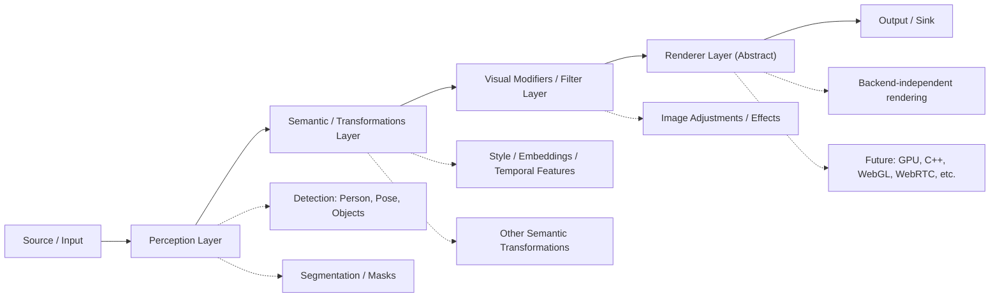

# Pipeline V1 — Arquitectura conceptual

El pipeline del Spatial-Iteration-Engine V1 está diseñado para ser **modular y desacoplado**: cada capa tiene una responsabilidad clara y no depende de tecnologías ni formatos concretos. Las implementaciones (cámara, ASCII, UDP, ONNX, etc.) viven en adapters; el flujo se define por capas abstractas.

## Las seis capas

### 1. Source / Input

- **Responsabilidad:** Capturar frames desde cámara, video o generador.
- **Salida:** Frame crudo (buffer de imagen); entrada única para el resto del pipeline.
- **Agnóstico a:** Resolución, codec o destino final; solo expone “siguiente frame”.

**En el código:** `FrameSource` (port), implementaciones en `adapters/sources/` (OpenCVCameraSource, GeneratorSource).

---

### 2. Perception Layer

- **Responsabilidad:** Extraer **información semántica** del frame: detección de personas, poses, segmentación de objetos.
- **Salida:** Datos estructurados (bounding boxes, keypoints, máscaras). **No modifica la imagen.**
- **Agnóstico a:** Estilo, filtros o renderer; solo describe el contenido.

**En el código:** `AnalyzerPipeline` + analizadores que implementan el protocolo `Analyzer`. Implementaciones: FaceHaarAnalyzer; stubs en `python/perception/` (PersonDetectionAnalyzer, PoseEstimationAnalyzer, SilhouetteSegmentationAnalyzer). Tracking opcional sobre estas detecciones (`TrackingPipeline`).

---

### 3. Semantic / Transformations Layer

- **Responsabilidad:** Transformaciones **conceptuales**: vectores de estilo, embeddings, coherencia temporal entre frames. Independiente de filtros puramente visuales.
- **Salida:** Metadatos/vectores que pueden consumir capas posteriores (p. ej. estilo para el render o para filtros condicionados).
- **Agnóstico a:** Brillo, contraste o backend de render; solo opera sobre significado/estilo/tiempo.

**En el código:** `TransformationPipeline` (transformaciones espaciales opcionales: warp, blend). Semántica de estilo: stubs en `python/style/` (StyleEncoder, NeuralStylizerFilter, TemporalCoherenceFilter). Los vectores de estilo y la coherencia temporal se integran aquí o en la capa de filtros según implementación.

---

### 4. Visual Modifiers / Filter Layer

- **Responsabilidad:** Aplicar **transformaciones puramente visuales** sobre el frame: brillo, contraste, efectos. No asume ningún renderer ni output concreto.
- **Salida:** Frame modificado (mismo formato conceptual: buffer de imagen).
- **Agnóstico a:** Destino final (pantalla, archivo, red); solo modifica píxeles.

**En el código:** `FilterPipeline` + protocolo `Filter`. Implementaciones en `adapters/processors/filters/` (BrightnessFilter, InvertFilter, EdgeFilter, DetailBoostFilter) y opcionalmente NeuralStylizerFilter desde `python/style/`.

---

### 5. Renderer Layer (Abstract)

- **Responsabilidad:** Recibir el frame final y **entregarlo** a la capa de salida. Completamente agnóstico a tecnología: puede ser software, GPU, C++, WebGL, WebRTC; ASCII es una implementación de demo.
- **Salida:** Objeto “renderizado” (p. ej. `RenderFrame`: imagen + metadata) listo para el sink.
- **Agnóstico a:** Origen del frame y tipo de sink; solo convierte frame → representación lista para output.

**En el código:** `FrameRenderer` (port). Implementaciones: `AsciiRenderer`, futuras: render C++ (bridge), WebGL, etc. Ver `docs/integration_v1.md` para contrato Python–C++.

---

### 6. Output / Sink

- **Responsabilidad:** Enviar el resultado a su **destino final**: pantalla, archivo, red (UDP, RTSP, NDI, WebRTC), etc.
- **Agnóstico a:** Cómo se generó el frame; solo recibe un “frame listo” y lo escribe.

**En el código:** `OutputSink` (port). Implementaciones en `adapters/outputs/` (FfmpegUdpOutput, FfmpegRtspSink, NdiSink, WebRTC, AsciiFrameRecorder, etc.).

---

## Orden de ejecución en el orquestador

El flujo real en `PipelineOrchestrator` respeta este orden conceptual:

1. **Source** → lectura del frame.
2. **Perception** → análisis (detección, pose, segmentación); resultado en `analysis`.
3. **Tracking** (opcional) → sobre detecciones.
4. **Semantic / Transformations** → transformaciones espaciales y/o semánticas (estilo, temporal).
5. **Visual Modifiers** → filtros aplicados al frame con opcional uso de `analysis`.
6. **Renderer** → frame → `RenderFrame`.
7. **Output** → escritura en el sink.

Así se mantiene la separación: percepción solo describe; transformaciones semánticas y filtros visuales son etapas distintas; el renderer y el sink permanecen agnósticos al origen y al formato concreto.

## Relación con la arquitectura hexagonal

- **Ports** definen los contratos de cada capa (FrameSource, Analyzer, Filter, FrameRenderer, OutputSink, SpatialTransform, ObjectTracker).
- **Application** orquesta el orden de las etapas y no conoce implementaciones concretas.
- **Adapters** (y módulos externos como `python/perception/`, `python/style/`, `cpp/`) implementan esos contratos sin que el pipeline dependa de tecnologías específicas.

Para más detalle sobre capas internas (domain, ports, application, adapters, infrastructure), ver [architecture.md](architecture.md).
